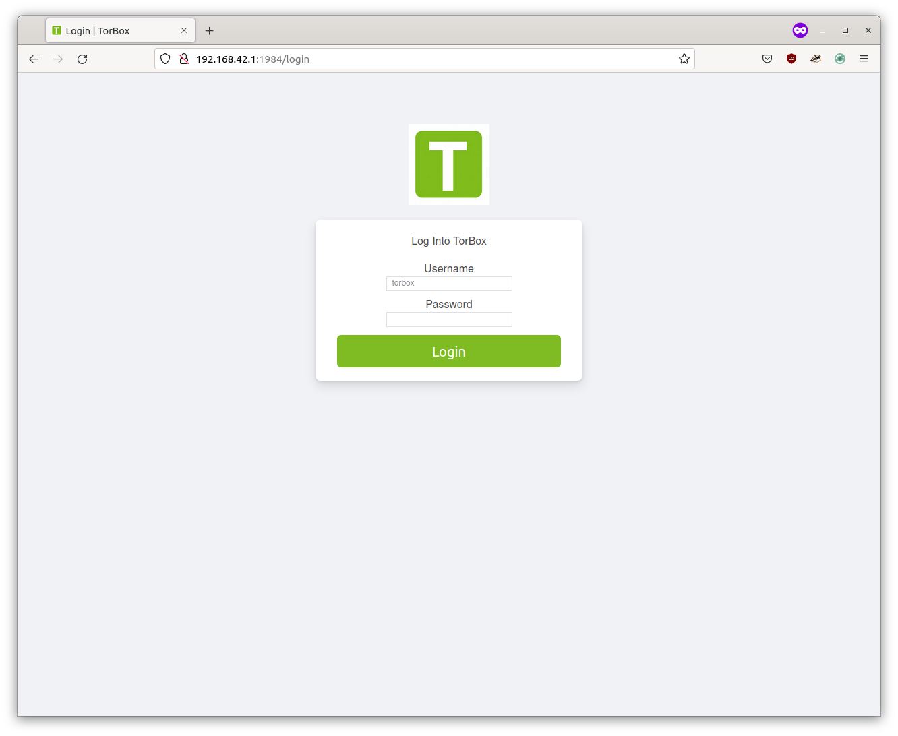
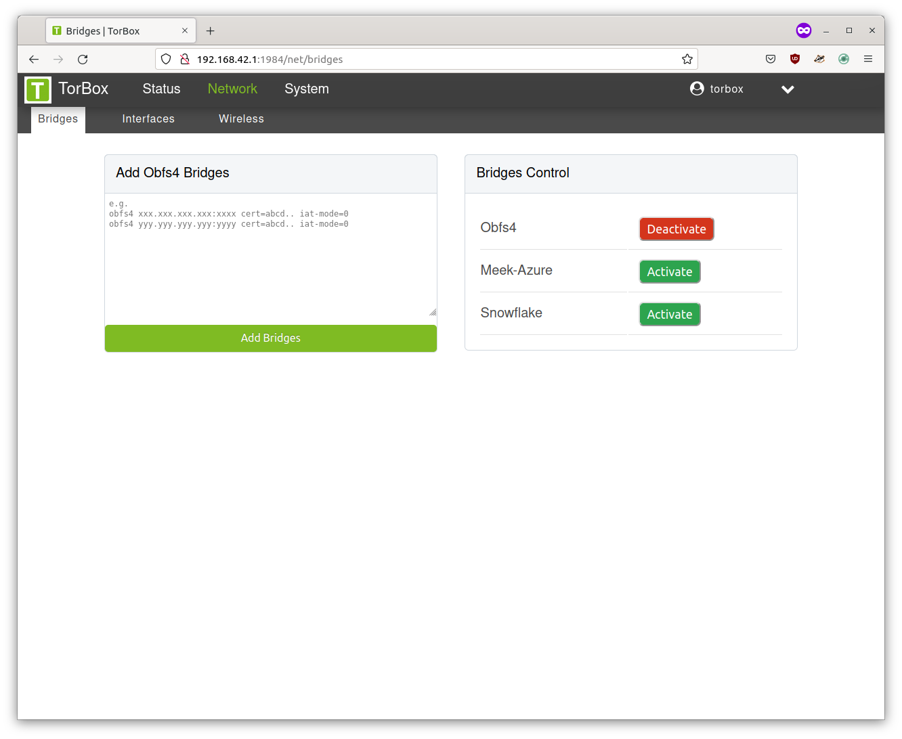
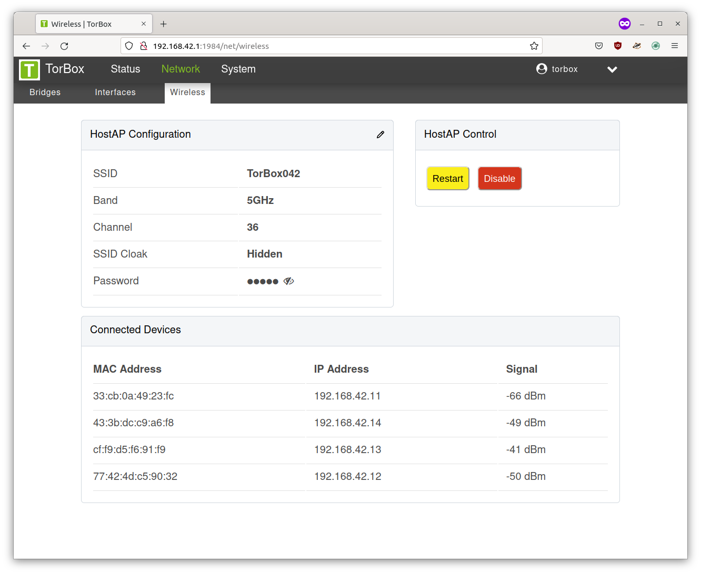

# TorCI

TorCI is a Configuration Interface for [TorBox](https://github.com/radio24/torbox). It is implemented in the [Nim](https://nim-lang.org) programming language.

<b>WARNING: THIS IS A ALPHA VERSION, THEREFORE YOU MAY ENCOUNTER BUGS. IF YOU DO, OPEN AN ISSUE VIA OUR GITHUB REPOSITORY.</b>

## Features:

-   [x] Configure [TorBox](https://radio24/torbox) as easy as [OpenWrt](https://github.com/openwrt)'s [LuCI](https://github.com/openwrt/luci)
-   [x] JavaScript not required
-   [x] No Terminal
-   [x] Mobile-friendly
-   [x] Lightweight

## Roadmap

-	[ ] Improving UI
-	[ ] All TorBox features support
-	[ ] HTTPS support

## Screenshots





## Installation

### Docker

To build and run TorCI in Docker

```bash
$ docker build -t torci:debug .
$ docker run --rm -d -p 1984:1984 torci:debug
# See debug logs
$ docker logs `CONTAINER_ID`
```

Reach TorCI: `0.0.0.0:1984` (username and password: `torbox`)

### Nimble

To compile the scss files, you need to install `libsass`. On Ubuntu and Debian, you can use `libsass-dev`.

```bash
$ git clone https://github.com/nonnil/torci
$ cd torci
$ nimble build
$ nimble scss
```

and Run:

```bash
$ sudo ./torci
```

Then access the following address with a browser:

```
http://0.0.0.0:1984
```
## SystemD
You can use the SystemD service (install it on `/etc/systemd/system/torci.service`)

To run TorCI via SystemD you can use this service file:

```ini
[Unit]
Description=front-end for TorBox
After=syslog.target
After=network.target

[Service]
Type=simple

User=root

WorkingDirectory=/home/torbox/torci
ExecStart=/home/torbox/torci/torci

Restart=always
RestartSec=15

[Install]
WantedBy=multi-user.target
```
